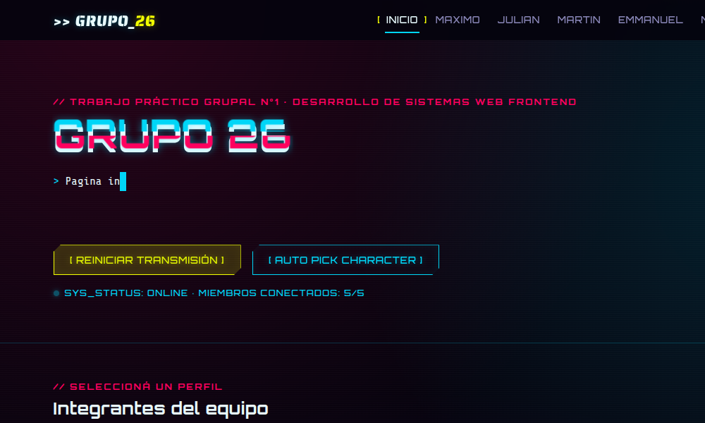
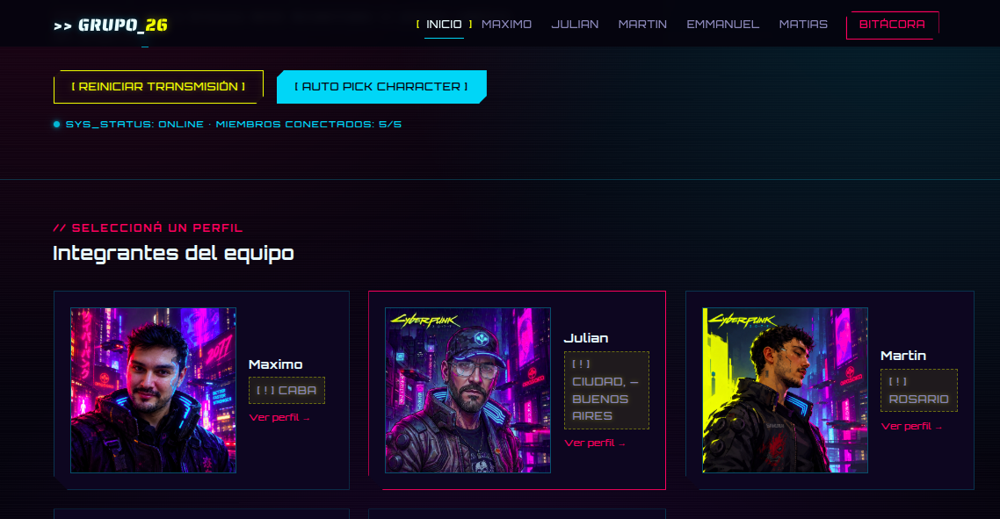
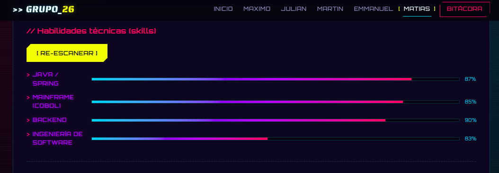
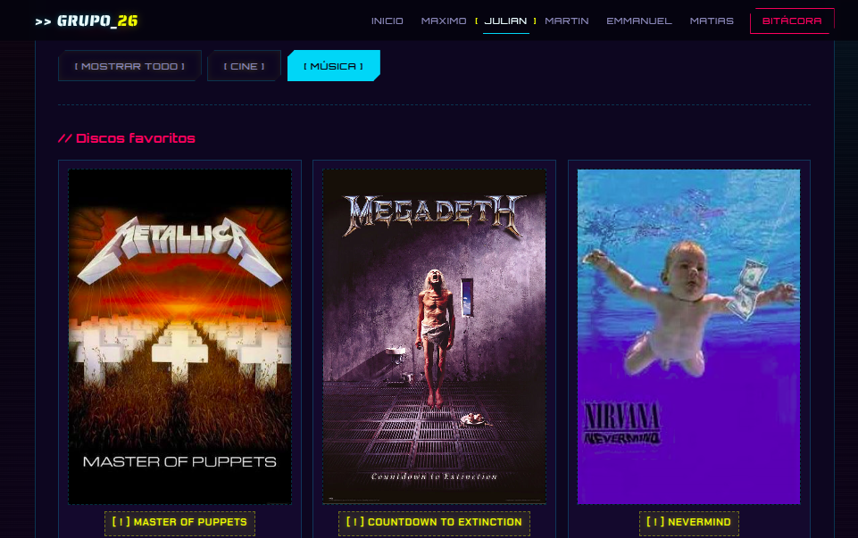
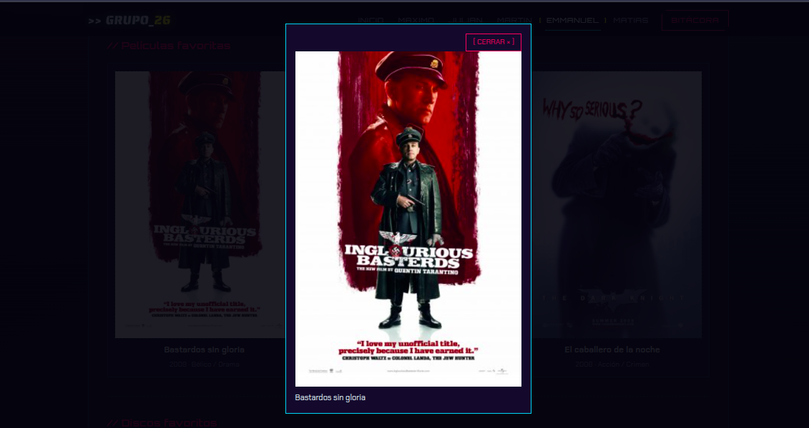
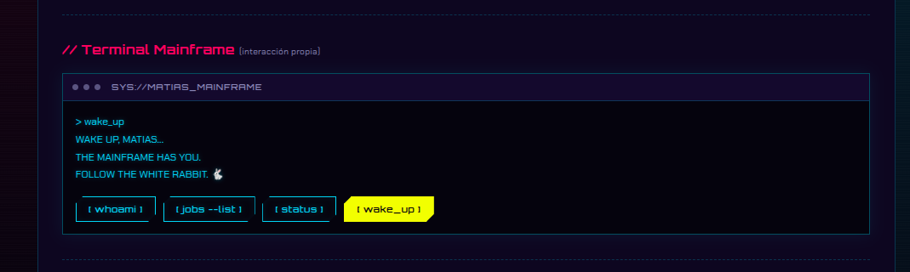
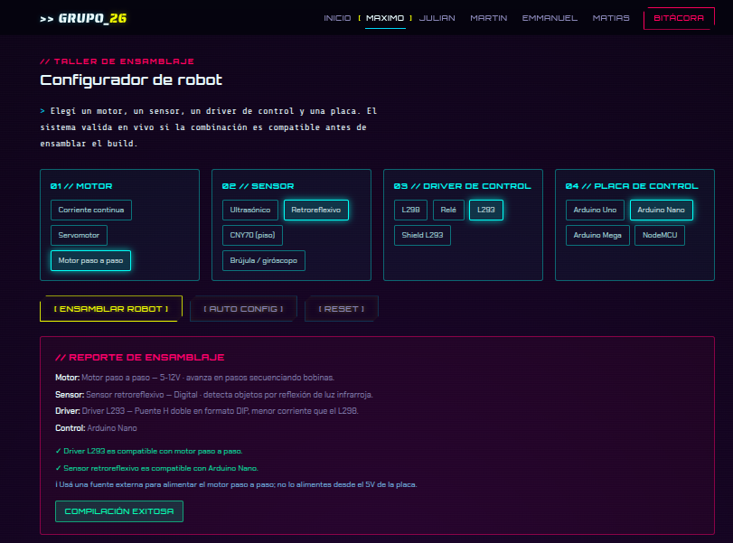

# TP1 · Grupo 26 - Sitio web grupal (estética Cyberpunk 2077)

Sitio web del **equipo 26** para el **Trabajo Práctico Grupal n° 1** de la asignatura **Desarrollo de Sistemas Web FrontEnd (2026)**.
Portada con presentación del equipo, un perfil individual por integrante y bitácora del proceso.
Hecho con HTML, CSS y JavaScript puro, sin frameworks ni build step.

## Integrantes del equipo 26

- Maximo — [PereiraMax](https://github.com/PereiraMax)
- Julian — [juliganSW](https://github.com/juliganSW)
- Martin — [martin-2t](https://github.com/martin-2t)
- Emmanuel — [Emmanuel-Valdez](https://github.com/Emmanuel-Valdez)
- Matias — [mdev-repos](https://github.com/mdev-repos)

## Tecnologías utilizadas

- HTML5 semántico
- CSS3 propio (variables CSS, Flexbox + Grid, animaciones y media queries)
- JavaScript puro (sin librerías)
- Google Fonts
- Asistentes de IA (distintos por integrante — ver detalle en [Uso de IA](#uso-de-ia))
- Vercel (deploy)

## Estructura de archivos y carpetas

```text
frontend_grupo_26__tp_1/
|
|-- index.html              # portada (equipo + listado de integrantes)
|-- emmanuel.html            # perfil de Emmanuel
|-- julian.html               # perfil de Julian
|-- martin.html                # perfil de Martin
|-- matias.html                 # perfil de Matias
|-- maximo.html                  # perfil de Maximo
|-- bitacora.html                 # bitácora del proceso
|-- README.md                      # este archivo
|
|-- css/
|   |--- style.css           # estilos de todo el sitio
|
|-- js/
|   |--- main.js              # menú responsive + interacciones de la portada
|   |--- perfil.js             # escaneo de habilidades (perfiles)
|   |--- emmanuel.js            # lightbox propio del perfil de Emmanuel
|   |--- matias.js               # terminal mainframe propia del perfil de Matias
|   |--- robot-config.js          # configurador de robot propio del perfil de Maximo
|
|-- img/
    |--- avatar-placeholder.svg  # avatar genérico de respaldo
    |--- emmanuel/                # foto, pósters y carátulas de Emmanuel
    |--- julian/                   # avatar, pósters y carátulas de Julian
    |--- martin/                    # avatar, pósters y carátulas de Martin
    |--- matias/                     # avatar, pósters y carátulas de Matias
    |--- maximo/                      # avatar, pósters y carátulas de Maximo
    |--- capturas/                     # capturas de pantalla de las funciones dinámicas
```

## Guía de estilos

Temática inspirada en Cyberpunk 2077: fondos oscuros, neones cian/magenta y tipografías condensadas.

| Uso | Color | Hex |
|---|---|---|
| Fondo vacío | negro azulado | `#04050d` |
| Paneles | azul noche / alternativo | `#0a0d1f` / `#10142c` |
| Acento principal | amarillo neón | `#fcee0a` |
| Acento secundario | cian | `#02d7f2` |
| Acento alerta | magenta | `#ff2a6d` |
| Detalles | púrpura | `#a45bff` |
| Texto | blanco hielo / gris | `#eafcff` / `#8590b5` |

- **Google Fonts:** `Orbitron` (títulos) + `Chakra Petch` (cuerpo); la portada suma `Saira Stencil One` y `Share Tech Mono`.
- **Iconografía:** avatar placeholder propio (`img/avatar-placeholder.svg`), fotos aportadas por cada integrante y símbolos de texto (`☰`, `📍`, `💻`, `→`).
- **Responsive:** mobile-first con breakpoints en `400px`, `900px` y `1200px`, sin desbordes.

## Funciones JavaScript

### Portada (`js/main.js`)

- **Menú hamburguesa:** muestra/oculta la navegación en pantallas chicas (también corre en las demás páginas).
- **Typewriter:** el texto de bienvenida se escribe letra por letra como una terminal.
- **Reiniciar transmisión:** re-ejecuta el typewriter y dispara un glitch pasajero en el título (se apaga solo al terminar la animación).

  <p align="center"></p>

- **Selección de personaje:** el botón `[ AUTO PICK CHARACTER ]` resalta una tarjeta al azar; también se puede click-ear directamente sobre cualquier tarjeta para marcarla, liberando la que estaba marcada antes.

  <p align="center"></p>

### Perfiles (`js/perfil.js` + `js/emmanuel.js` + `js/matias.js` + `js/robot-config.js`)

- **Escanear habilidades:** anima las barras de skill hasta el nivel (`data-value`) de cada integrante, en cascada. Corre al cargar y con el botón `[ ESCANEAR / RE-ESCANEAR ]`.

  <p align="center"></p>

- **Filtro de contenido (Julian):** botones `[ MOSTRAR TODO / CINE / MÚSICA ]` que muestran u ocultan las secciones `.media-section` según `data-filter`/`data-category`.

  <p align="center"></p>

- **Lightbox de Emmanuel (`js/emmanuel.js`, solo `emmanuel.html`):** click en una tarjeta de película/disco la abre en grande (modal con título); cierra con Esc, botón `[ CERRAR × ]` o click fuera. No toca `main.js` ni `perfil.js`.

  <p align="center"></p>

- **Terminal Mainframe de Matias (`js/matias.js`, solo `matias.html`):** 4 botones de comandos falsos (`whoami`, `jobs --list`, `status`, `wake_up`) que tipean la respuesta letra por letra en una pantalla de terminal. El comando `wake_up` tira una referencia a Matrix ("Wake up, Matias... the mainframe has you. Follow the white rabbit."). No toca `main.js` ni `perfil.js`.

  <p align="center"></p>

- **Configurador de robot de Maximo (`js/robot-config.js`, solo `maximo.html`):** se elige un motor, sensor, driver y placa de control por chips; al ensamblar valida en vivo si la combinación es compatible (o incompatible) a nivel hardware y muestra un reporte estilo terminal. Incluye botones `[ ENSAMBLAR ROBOT ]`, `[ AUTO CONFIG ]` (arma una combinación al azar) y `[ RESET ]`.

  <p align="center"></p>

## URL publicada en Vercel

> https://equipo26tp1.vercel.app/index.html

## Evolución (para los siguientes trabajos)

- Revisar breakpoints y accesibilidad antes de cada entrega.

## Uso de IA

### Emmanuel

- **Herramientas:** opencode con el modelo Muse Spark 1.3 (plan gratuito).
- **Experiencia previa:** uso diario de agentes de IA en el flujo de ingeniería.
- **Qué asistió:** verificación de años/géneros de películas y discos para la tarjeta; revisión de estructura semántica del perfil; lightbox propio (`js/emmanuel.js` + estilos + modal) y porcentajes de skills variados (90/85/80/70).
- **Criterio propio:** todos los textos, datos, imágenes y la bitácora se decidieron y revisaron a mano; el JS del equipo (`main.js`, `perfil.js`) se reusó sin cambios y el lightbox nuevo se probó a mano (abrir/cerrar con Esc, botón y click fuera).
- **Imágenes:** foto propia (`emma.jpg`); pósters y carátulas descargados de páginas web públicas.

### Matias

- **Herramientas:** Claude (Anthropic), modelo Sonnet 5, a través de Claude Code (plan Pro, de pago); también Python + Pillow (librería de manipulación de imágenes, sin IA) para el recorte/composición del logo del avatar.
- **Experiencia previa:** ya había usado Claude Code en otro trabajo individual (PFO1) para armar un sitio de punta a punta, así que esta fue una segunda vez, ya con más criterio propio sobre qué pedir y qué no.
- **Qué asistió:** revisión de la estructura del repo y de todas las ramas antes de tocar nada (para detectar conflictos pendientes entre ramas sin mergear); armado de mi tarjeta (`matias.html`) siguiendo el template de Martin/Emmanuel; código de la función propia "Terminal Mainframe" (`js/matias.js` + estilos en `css/style.css`); ayuda para pensar 3 ideas de interacción que no se repitieran con las de mis compañeros, de las cuales elegí y adapté una; también el favicon (`img/branding/favicon-equipo26.svg`) del equipo, hecho a mano en SVG con el efecto glitch/paleta del sitio, sin usar ninguna IA de imágenes.
- **Criterio propio:** yo definí los datos reales (ciudad, edad, skills, películas, discos), elegí qué película sacar de las 4 que tenía, decidí el concepto final de la terminal (comandos + referencia a Matrix) y probé a mano que los 4 botones respondan bien y que el resto del sitio (nav, scan de skills) siga funcionando igual. Por ultimo, retoque el codigo de forma manual para pulir los ultimos detalles.
- **Imágenes:** avatar (`avatar_matias.png`) generado por mí con una IA de imágenes (estética cyberpunk, prompt propio ambientado en la temática del sitio). Para que quedara consistente con los avatares de Martin y Julian (que parten del arte oficial de Cyberpunk 2077 con el logo del juego incluido), le recorté el logo "Cyberpunk 2077" a la imagen de Martin, le quité el fondo oscuro con un script propio en Python/Pillow (umbral por luminosidad, sin IA) y lo superpuse en la esquina superior izquierda de mi avatar, mismo lugar y proporción relativa que en las otras tarjetas. Pósters y carátulas descargados de páginas web públicas.

> <!-- PENDIENTE GRUPO: falta el bloque de Maximo, Julian y Martin. -->

## Entrega

En la planilla única de entregas se carga un solo enlace: el de este repositorio público. La URL de Vercel se revisa desde este README.